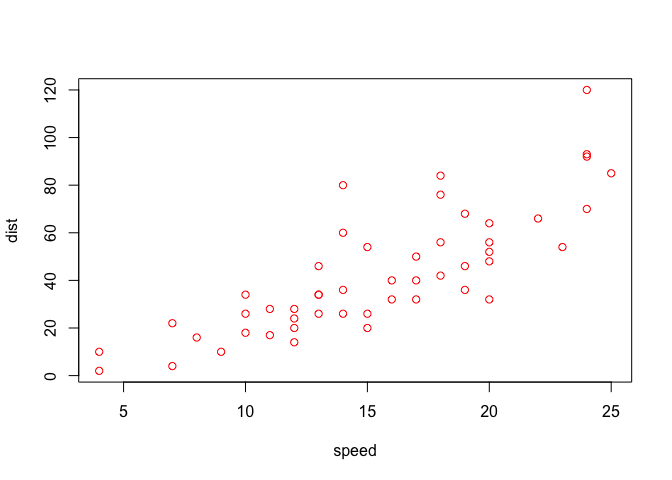

1. Simulation
2. Dates and Times
3. Base Graphics

## Simulation

One of the great advantages of using a statistical programming language like R is its vast collection of tools for simulating random numbers.

This lesson assumes familiarity with a few common probability distributions, but these topics will only be discussed with respect to random number generation. Even if you have no prior experience with these concepts, you should be able to complete the lesson and understand the main ideas.

The first function we'll use to generate random numbers is sample(). Use ?sample to pull up the documentation.


```r
?sample
```

Let's simulate rolling four six-sided dice: sample(1:6, 4, replace = TRUE).


```r
sample(1:6, 4, replace = TRUE)
```

```
## [1] 6 3 3 6
```

Now repeat the command to see how your result differs. (The probability of rolling the exact same result is (1/6)^4 = 0.00077, which is pretty small!)


```r
sample(1:6, 4, replace = TRUE)
```

```
## [1] 6 1 6 2
```

sample(1:6, 4, replace = TRUE) instructs R to randomly select four numbers between 1 and 6, WITH replacement. Sampling with replacement simply means that each number is "replaced" after it is selected, so that the same number can show up more than once. This is what we want here, since what you roll on one die shouldn't affect what you roll on any of the others.

Now sample 10 numbers between 1 and 20, WITHOUT replacement. To sample without replacement, simply leave off the 'replace' argument.


```r
sample(1:20, 10)
```

```
##  [1]  7 10  8 15  5 11 13 18  4  3
```

Since the last command sampled without replacement, no number appears more than once in the output.

LETTERS is a predefined variable in R containing a vector of all 26 letters of the English alphabet. Take a look at it now.


```r
LETTERS
```

```
##  [1] "A" "B" "C" "D" "E" "F" "G" "H" "I" "J" "K" "L" "M" "N" "O" "P" "Q" "R" "S"
## [20] "T" "U" "V" "W" "X" "Y" "Z"
```

The sample() function can also be used to permute, or rearrange, the elements of a vector. For example, try sample(LETTERS) to permute all 26 letters of the English alphabet.


```r
sample(LETTERS)
```

```
##  [1] "E" "U" "F" "D" "B" "G" "W" "T" "R" "P" "V" "O" "I" "J" "Y" "S" "L" "M" "K"
## [20] "Q" "C" "H" "N" "A" "X" "Z"
```

This is identical to taking a sample of size 26 from LETTERS, without replacement. When the 'size' argument to sample() is not specified, R takes a sample equal in size to the vector from which you are sampling.

Now, suppose we want to simulate 100 flips of an unfair two-sided coin. This particular coin has a 0.3 probability of landing 'tails' and a 0.7 probability of landing 'heads'.

Let the value 0 represent tails and the value 1 represent heads. Use sample() to draw a sample of size 100 from the vector c(0,1), with replacement. Since the coin is unfair, we must attach specific probabilities to the values 0 (tails) and 1 (heads) with a fourth argument, prob = c(0.3, 0.7). Assign the result to a new variable called flips.


```r
flips <- sample(c(0, 1), 100, replace=TRUE, c(0.3, 0.7))
```

View the contents of the flips variable.


```r
flips
```

```
##   [1] 0 0 1 0 0 1 1 0 0 0 0 1 0 1 1 1 1 1 0 0 1 0 1 0 1 1 1 1 1 1 0 1 1 1 1 0 1
##  [38] 1 1 0 1 1 1 0 0 1 1 0 0 1 1 0 1 1 1 1 1 1 0 1 1 1 1 1 1 0 0 1 1 0 1 1 1 1
##  [75] 1 0 1 1 1 1 1 1 1 1 0 1 1 1 0 1 1 1 0 1 1 0 1 1 0 1
```

Since we set the probability of landing heads on any given flip to be 0.7, we'd expect approximately 70 of our coin flips to have the value 1. Count the actual number of 1s contained in flips using the sum() function.


```r
sum(flips)
```

```
## [1] 69
```

A coin flip is a binary outcome (0 or 1) and we are performing 100 independent trials (coin flips), so we can use rbinom() to simulate a binomial random variable. Pull up the documentation for rbinom() using ?rbinom.

Each probability distribution in R has an r*** function (for "random"), a d*** function (for "density"), a p*** (for "probability"), and q*** (for "quantile"). We are most interested in the r*** functions in this lesson, but I encourage you to explore the others on your own.

A binomial random variable represents the number of 'successes' (heads) in a given number of independent 'trials' (coin flips). Therefore, we can generate a single random variable that represents the number of heads in 100 flips of our unfair coin using rbinom(1, size = 100, prob = 0.7). Note that you only specify the probability of 'success' (heads) and NOT the probability of 'failure' (tails). Try it now.


```r
rbinom(1, size = 100, prob = 0.7)
```

```
## [1] 66
```

Equivalently, if we want to see all of the 0s and 1s, we can request 100 observations, each of size 1, with success probability of 0.7. Give it a try, assigning the result to a new variable called flips2.


```r
flips2 <- rbinom(n=100, size=1, prob=0.7)
```

View the contents of flips2.


```r
flips2
```

```
##   [1] 1 1 1 1 1 1 0 0 1 1 0 1 1 1 0 1 1 1 1 1 1 1 1 1 0 1 1 1 0 1 1 1 1 1 1 1 1
##  [38] 1 1 0 0 1 0 1 1 1 1 1 0 1 1 1 1 1 1 1 1 1 0 0 1 1 1 1 1 0 1 1 0 1 1 1 1 1
##  [75] 1 1 1 0 1 0 1 1 1 0 1 1 1 1 1 1 1 1 1 1 0 1 1 0 1 1
```

Now use sum() to count the number of 1s (heads) in flips2. It should be close to 70!


```r
sum(flips2)
```

```
## [1] 81
```

Similar to rbinom(), we can use R to simulate random numbers from many other probability distributions. Pull up the documentation for rnorm() now.

The standard normal distribution has mean 0 and standard deviation 1. As you can see under the 'Usage' section in the documentation, the default values for the 'mean' and 'sd' arguments to rnorm() are 0 and 1, respectively. Thus, rnorm(10) will generate 10 random numbers from a standard normal distribution. Give it a try.


```r
rnorm(10)
```

```
##  [1] -0.5791922 -1.6205799 -0.3577025 -1.5925055  0.6190264 -1.4875537
##  [7]  0.3231585 -0.5162475  0.9674432 -2.6165211
```

Now do the same, except with a mean of 100 and a standard deviation of 25.


```r
rnorm(n=10, mean=100, sd=25)
```

```
##  [1]  96.54907 148.70085 120.05413  90.42915  88.06401  83.89971  90.71342
##  [8]  86.67314  81.61205 109.72097
```

Finally, what if we want to simulate 100 *groups* of random numbers, each containing 5 values generated from a Poisson distribution with mean 10? Let's start with one group of 5 numbers, then I'll show you how to repeat the operation 100 times in a convenient and compact way.

Generate 5 random values from a Poisson distribution with mean 10. Check out the documentation for rpois() if you need help.


```r
rpois(n=5, lambda=10)
```

```
## [1] 12  4  6  7  6
```

Now use replicate(100, rpois(5, 10)) to perform this operation 100 times. Store the result in a new variable called my_pois.


```r
my_pois <- replicate(100, rpois(5, 10))
```

Take a look at the contents of my_pois.


```r
my_pois
```

```
##      [,1] [,2] [,3] [,4] [,5] [,6] [,7] [,8] [,9] [,10] [,11] [,12] [,13] [,14]
## [1,]   10   14    7   10   14    9   15    8    7     8     9    10     8     9
## [2,]   10   10   11   10   10   15    9   13   14     9     7    11    12     7
## [3,]    7   10   15   11   13   12    9   12   21     9    14    11     6     5
## [4,]   11    9    9    4   15    6   13   12   12     8     9    15     9    11
## [5,]    8   11    9   11   22    9    9   13   13    10    15     9     3    11
##      [,15] [,16] [,17] [,18] [,19] [,20] [,21] [,22] [,23] [,24] [,25] [,26]
## [1,]    12     7     5     7    11     9    11    10    10     4     9    11
## [2,]     9     6     8    13     7    10     9     8    13    11    11    11
## [3,]     9    10     6     4     7     8    10    10    10    10     8     6
## [4,]     9     8     8    12    11    12     8    11    12     9     7     5
## [5,]     8    13     3    16     8    13    11     9    10     9     8     8
##      [,27] [,28] [,29] [,30] [,31] [,32] [,33] [,34] [,35] [,36] [,37] [,38]
## [1,]     6    14     5     9    10    10     7     6    11     9    11     9
## [2,]    23    11     7     9     9     8    13    13    11    11    10     4
## [3,]    10     8     8    17    11     7     7     8     9     8    16    11
## [4,]    12    11     7     4    10    12    11     9     9    13     5     7
## [5,]     9    11    10    12    12     9    12     9    11    10    10     9
##      [,39] [,40] [,41] [,42] [,43] [,44] [,45] [,46] [,47] [,48] [,49] [,50]
## [1,]    11    14     9    11     2     8    14     9    10     4     7     6
## [2,]     8    10    12     8    15     7    12     8     8    11    12     8
## [3,]    12     8    10    11     6    14    10     5    12    14    10     7
## [4,]     4    16    16    15    10     6    12     8     8     9     9    12
## [5,]    15    10     3     5     8     6    11     9     8    10    11     7
##      [,51] [,52] [,53] [,54] [,55] [,56] [,57] [,58] [,59] [,60] [,61] [,62]
## [1,]    12    11    11     8    10    12     6     7    10    11    11    13
## [2,]     9     7    15    13     5    12    12     8    10     6     9    10
## [3,]    12     6    10     5     9    12     9    13     8    11    14    12
## [4,]     5    12     6     6    11    12    11    15     8    17     9    10
## [5,]     8    10    11    11    13    14     2     8    11    13    20     9
##      [,63] [,64] [,65] [,66] [,67] [,68] [,69] [,70] [,71] [,72] [,73] [,74]
## [1,]    10     8     8    11     7     6     7     9    12    13    15     9
## [2,]    15    13    12     6    10     7     4     6     5    13    11    15
## [3,]     9     7    11    12     7     9    12    12     8     8     7     7
## [4,]     6    13    13    19     5     8    10    12     8     7    10    10
## [5,]     7     3     9    12    10    10     7    10     5     6     9    11
##      [,75] [,76] [,77] [,78] [,79] [,80] [,81] [,82] [,83] [,84] [,85] [,86]
## [1,]     9    10    10    10    12     6     9    11    10    14     6    10
## [2,]    11     6    10     6     6    11    12    11    11     7    10     8
## [3,]     9    14     9     6     9     7    10    10     3     6     9    13
## [4,]    11     9     7    11    11     8    13     7    16    12    12    10
## [5,]     7     9    13    14    12    12    15    12    14     9     8    11
##      [,87] [,88] [,89] [,90] [,91] [,92] [,93] [,94] [,95] [,96] [,97] [,98]
## [1,]    15     7     5     9     6    12     5     7     5    11    15    13
## [2,]    11     9    10    18     5     8     9    11     8    12     6    18
## [3,]     9     9    10    11    10     6    10    11    13     9     7     5
## [4,]     9    14     8     9     8     4     8    11    19    12     8     4
## [5,]     9    11    12    16    12    11    19    14     6    13     8    11
##      [,99] [,100]
## [1,]    20     10
## [2,]     7      6
## [3,]    10      9
## [4,]     6     12
## [5,]    13     12
```

replicate() created a matrix, each column of which contains 5 random numbers generated from a Poisson distribution with mean 10. Now we can find the mean of each column in my_pois using the colMeans() function. Store the result in a variable called cm.


```r
cm <- colMeans(my_pois)
```

And let's take a look at the distribution of our column means by plotting a histogram with hist(cm).


```r
hist(cm)
```

<!-- -->

Looks like our column means are almost normally distributed, right? That's the Central Limit Theorem at work, but that's a lesson for another day!

All of the standard probability distributions are built into R, including exponential (rexp()), chi-squared (rchisq()), gamma (rgamma()), .... Well, you see the pattern.

Simulation is practically a field of its own and we've only skimmed the surface of what's possible. I encourage you to explore these and other functions further on your own.

## Dates and Times

R has a special way of representing dates and times, which can be helpful if you're working with data that show how something changes over time (i.e. time-series data) or if your data contain some other temporal information, like dates of birth.

Dates are represented by the 'Date' class and times are represented by the 'POSIXct' and 'POSIXlt' classes. Internally, dates are stored as the number of days since 1970-01-01 and times are stored as either the number of seconds since 1970-01-01 (for 'POSIXct') or a list of seconds, minutes, hours, etc. (for 'POSIXlt').

Let's start by using d1 <- Sys.Date() to get the current date and store it in the variable d1. (That's the letter 'd' and the number 1.)


```r
d1 <- Sys.Date()
```

Use the class() function to confirm d1 is a Date object.


```r
class(d1)
```

```
## [1] "Date"
```

We can use the unclass() function to see what d1 looks like internally. Try it out.


```r
unclass(d1)
```

```
## [1] 18370
```

That's the exact number of days since 1970-01-01!

However, if you print d1 to the console, you'll get today's date -- YEAR-MONTH-DAY. Give it a try.


```r
d1
```

```
## [1] "2020-04-18"
```

What if we need to reference a date prior to 1970-01-01? Create a variable d2 containing as.Date("1969-01-01").


```r
d2 <- as.Date("1969-01-01")
```

Now use unclass() again to see what d2 looks like internally.


```r
unclass(d2)
```

```
## [1] -365
```

As you may have anticipated, you get a negative number. In this case, it's -365, since 1969-01-01 is exactly one calendar year (i.e. 365 days) BEFORE 1970-01-01.

Now, let's take a look at how R stores times. You can access the current date and time using the Sys.time() function with no arguments. Do this and store the result in a variable called t1.


```r
t1 <- Sys.time()
```

View the contents of t1.


```r
t1
```

```
## [1] "2020-04-18 15:11:08 BST"
```

And check the class() of t1.


```r
class(t1)
```

```
## [1] "POSIXct" "POSIXt"
```

As mentioned earlier, POSIXct is just one of two ways that R represents time information. (You can ignore the second value above, POSIXt, which just functions as a common language between POSIXct and POSIXlt.) Use unclass() to see what t1 looks like internally -- the (large) number of seconds since the beginning of 1970.


```r
unclass(t1)
```

```
## [1] 1587219069
```

By default, Sys.time() returns an object of class POSIXct, but we can coerce the result to POSIXlt with as.POSIXlt(Sys.time()). Give it a try and store the result in t2.


```r
t2 <- as.POSIXlt(Sys.time())
```

Check the class of t2.


```r
class(t2)
```

```
## [1] "POSIXlt" "POSIXt"
```

Now view its contents.


```r
t2
```

```
## [1] "2020-04-18 15:11:08 BST"
```

The printed format of t2 is identical to that of t1. Now unclass() t2 to see how it is different internally.


```r
unclass(t2)
```

```
## $sec
## [1] 8.819044
## 
## $min
## [1] 11
## 
## $hour
## [1] 15
## 
## $mday
## [1] 18
## 
## $mon
## [1] 3
## 
## $year
## [1] 120
## 
## $wday
## [1] 6
## 
## $yday
## [1] 108
## 
## $isdst
## [1] 1
## 
## $zone
## [1] "BST"
## 
## $gmtoff
## [1] 3600
## 
## attr(,"tzone")
## [1] ""    "BST" "BST"
```

t2, like all POSIXlt objects, is just a list of values that make up the date and time. Use str(unclass(t2)) to have a more compact view.


```r
str(unclass(t2))
```

```
## List of 11
##  $ sec   : num 8.82
##  $ min   : int 11
##  $ hour  : int 15
##  $ mday  : int 18
##  $ mon   : int 3
##  $ year  : int 120
##  $ wday  : int 6
##  $ yday  : int 108
##  $ isdst : int 1
##  $ zone  : chr "BST"
##  $ gmtoff: int 3600
##  - attr(*, "tzone")= chr [1:3] "" "BST" "BST"
```

If, for example, we want just the minutes from the time stored in t2, we can access them with t2$min. Give it a try.


```r
t2$min
```

```
## [1] 11
```

Now that we have explored all three types of date and time objects, let's look at a few functions that extract useful information from any of these objects -- weekdays(), months(), and quarters().

The weekdays() function will return the day of week from any date or time object. Try it out on d1, which is the Date object that contains today's date.


```r
weekdays(d1)
```

```
## [1] "Saturday"
```

The months() function also works on any date or time object. Try it on t1, which is the POSIXct object that contains the current time (well, it was the current time when you created it).


```r
months(t1)
```

```
## [1] "April"
```

The quarters() function returns the quarter of the year (Q1-Q4) from any date or time object. Try it on t2, which is the POSIXlt object that contains the time at which you created it.


```r
quarters(t2)
```

```
## [1] "Q2"
```

Often, the dates and times in a dataset will be in a format that R does not recognize. The strptime() function can be helpful in this situation.

strptime() converts character vectors to POSIXlt. In that sense, it is similar to as.POSIXlt(), except that the input doesn't have to be in a particular format (YYYY-MM-DD).

To see how it works, store the following character string in a variable called t3: "October 17, 1986 08:24" (with the quotes).


```r
t3 <- "October 17, 1986 08:24"
```

Now, use strptime(t3, "%B %d, %Y %H:%M") to help R convert our date/time object to a format that it understands. Assign the result to a new variable called t4. (You should pull up the documentation for strptime() if you'd like to know more about how it works.)


```r
t4 <- strptime(t3, "%B %d, %Y %H:%M")
```

Print the contents of t4.


```r
t4
```

```
## [1] "1986-10-17 08:24:00 BST"
```

That's the format we've come to expect. Now, let's check its class().


```r
class(t4)
```

```
## [1] "POSIXlt" "POSIXt"
```

Finally, there are a number of operations that you can perform on dates and times, including arithmetic operations (+ and -) and comparisons (<, ==, etc.)

The variable t1 contains the time at which you created it (recall you used Sys.time()). Confirm that some time has passed since you created t1 by using the 'greater than' operator to compare it to the current time: Sys.time() > t1


```r
Sys.time() > t1
```

```
## [1] TRUE
```

So we know that some time has passed, but how much? Try subtracting t1 from the current time using Sys.time() - t1. Don't forget the parentheses at the end of Sys.time(), since it is a function.


```r
Sys.time() - t1
```

```
## Time difference of 0.135613 secs
```

The same line of thinking applies to addition and the other comparison operators. If you want more control over the units when finding the above difference in times, you can use difftime(), which allows you to specify a 'units' parameter.

Use difftime(Sys.time(), t1, units = 'days') to find the amount of time in DAYS that has passed since you created t1.


```r
difftime(Sys.time(), t1, units = 'days')
```

```
## Time difference of 1.621782e-06 days
```

In this lesson, you learned how to work with dates and times in R. While it is important to understand the basics, if you find yourself working with dates and times often, you may want to check out the lubridate package by Hadley Wickham.

One of the greatest strengths of R, relative to other programming languages, is the ease with which we can create publication-quality graphics. In this lesson, you'll learn about base graphics in R.

## Base Graphics

We do not cover the more advanced portions of graphics in R in this lesson. These include lattice, ggplot2 and ggvis.

There is a school of thought that this approach is backwards, that we should teach ggplot2 first. See
| http://varianceexplained.org/r/teach_ggplot2_to_beginners/ for an outline of this view.

Load the included data frame cars with data(cars).


```r
data(cars)
```

To fix ideas, we will work with simple data frames. Our main goal is to introduce various plotting functions and their arguments. All the output would look more interesting with larger, more complex data sets.

Pull up the help page for cars.

As you can see in the help page, the cars data set has only two variables: speed and stopping distance. Note that the data is from the 1920s.

Run head() on the cars data.


```r
head(cars)
```

```
##   speed dist
## 1     4    2
## 2     4   10
## 3     7    4
## 4     7   22
## 5     8   16
## 6     9   10
```

Before plotting, it is always a good idea to get a sense of the data. Key R commands for doing so include, dim(), names(), head(), tail() and summary().

Run the plot() command on the cars data frame.


```r
plot(cars)
```

<!-- -->

As always, R tries very hard to give you something sensible given the information that you have provided to it. First, R notes that the data frame you have given it has just two columns, so it assumes that you want to plot one column versus the other.

Second, since we do not provide labels for either axis, R uses the names of the columns. Third, it creates axis tick marks at nice round numbers and labels them accordingly. Fourth, it uses the other defaults supplied in plot().

We will now spend some time exploring plot, but many of the topics covered here will apply to most other R graphics functions. Note that 'plot' is short for scatterplot.

Look up the help page for plot().

The help page for plot() highlights the different arguments that the function can take. The two most important are x and y, the variables that will be plotted. For the next set of questions, include the argument names in your answers. That is, do not type plot(cars$speed, cars$dist), although that will work. Instead, use plot(x = cars$speed, y = cars$dist).

Use plot() command to show speed on the x-axis and dist on the y-axis from the cars data frame. Use the form of the plot command in which vectors are explicitly passed in as arguments for x and y.


```r
plot(x=cars$speed, y=cars$dist)
```

<!-- -->

Note that this produces a slightly different answer than plot(cars). In this case, R is not sure what you want to use as the labels on the axes, so it just uses the arguments which you pass in, data frame name and dollar signs included.

Note that there are other ways to call the plot command, i.e., using the "formula" interface. For example, we get a similar plot to the above with plot(dist ~ speed, cars). However, we will wait till later in the lesson before using the formula interface.

Use plot() command to show dist on the x-axis and speed on the y-axis from the cars data frame. This is the opposite of what we did above.


```r
plot(x=cars$dist, y=cars$speed)
```

<!-- -->

It probably makes more sense for speed to go on the x-axis since stopping distance is a function of speed more than the other way around. So, for the rest of the questions in this portion of the lesson, always assign the arguments accordingly.

In fact, you can assume that the answers to the next few questions are all of the form plot(x = cars$speed, y = cars$dist, ...) but with various arguments used in place of the ...

Recreate the plot with the label of the x-axis set to "Speed".


```r
plot(x=cars$speed, y=cars$dist, xlab="Speed")
```

<!-- -->

Recreate the plot with the label of the y-axis set to "Stopping Distance".


```r
plot(x=cars$speed, y=cars$dist, ylab="Stopping Distance")
```

<!-- -->

Recreate the plot with "Speed" and "Stopping Distance" as axis labels.


```r
plot(x=cars$speed, y=cars$dist, xlab="Speed", ylab="Stopping Distance")
```

<!-- -->

The reason that plots(cars) worked at the beginning of the lesson was that R was smart enough to know that the first element (i.e., the first column) in cars should be assigned to the x argument and the second element to the y argument. To save on typing, the next set of answers will all be of the form, plot(cars, ...) with various arguments added.

For each question, we will only want one additional argument at a time. Of course, you can pass in more than one argument when doing a real project.

Plot cars with a main title of "My Plot". Note that the argument for the main title is "main" not "title".


```r
plot(cars, main="My Plot")
```

<!-- -->

Plot cars with a sub title of "My Plot Subtitle".


```r
plot(cars, sub="My Plot Subtitle")
```

<!-- -->

The plot help page (?plot) only covers a small number of the many arguments that can be passed in to plot() and to other graphical functions. To begin to explore the many other options, look at ?par. Let's look at some of the more commonly used ones. Continue using plot(cars, ...) as the base answer to these questions.

Plot cars so that the plotted points are colored red. (Use col = 2 to achieve this effect.)


```r
plot(cars, col=2)
```

<!-- -->

Plot cars while limiting the x-axis to 10 through 15.  (Use xlim = c(10, 15) to achieve this effect.)


```r
plot(cars, xlim=c(10, 15))
```

<!-- -->

You can also change the shape of the symbols in the plot. The help page for points (?points) provides the details.

Plot cars using triangles.  (Use pch = 2 to achieve this effect.)


```r
plot(cars, pch=2)
```

<!-- -->

Arguments like "col" and "pch" may not seem very intuitive. And that is because they aren't! So, many/most people use more modern packages, like ggplot2, for creating their graphics in R.

It is, however, useful to have an introduction to base graphics because many of the idioms in lattice and ggplot2 are modeled on them.

Let's now look at some other functions in base graphics that may be useful, starting with boxplots.

Load the mtcars data frame.


```r
data(mtcars)
```

Anytime that you load up a new data frame, you should explore it before using it. In the middle of a swirl lesson, just type play(). This temporarily suspends the lesson (without losing the work you have already done) and allows you to issue commands like dim(mtcars) and head(mtcars). Once you are done examining the data, just type nxt() and the lesson will pick up where it left off.

Look up the help page for boxplot().

Instead of adding data columns directly as input arguments, as we did with plot(), it is often handy to pass in the entire data frame. This is what the "data" argument in boxplot() allows.

boxplot(), like many R functions, also takes a "formula" argument, generally an expression with a tilde ("~") which indicates the relationship between the input variables. This allows you to enter something like mpg ~ cyl to plot the relationship between cyl (number of cylinders) on the x-axis and mpg (miles per gallon) on the y-axis.

Use boxplot() with formula = mpg ~ cyl and data = mtcars to create a box plot.


```r
boxplot(formula = mpg ~ cyl, data = mtcars)
```

<!-- -->

The plot shows that mpg is much lower for cars with more cylinders. Note that we can use the same set of arguments that we explored with plot() above to add axis labels, titles and so on.

When looking at a single variable, histograms are a useful tool. hist() is the associated R function. Like plot(), hist() is best used by just passing in a single vector.

Use hist() with the vector mtcars$mpg to create a histogram.


```r
hist(mtcars$mpg)
```

<!-- -->

In this lesson, you learned how to work with base graphics in R. The best place to go from here is to study the ggplot2 package. If you want to explore other elements of base graphics, then this web page (http://www.ling.upenn.edu/~joseff/rstudy/week4.html) provides a useful overview.
